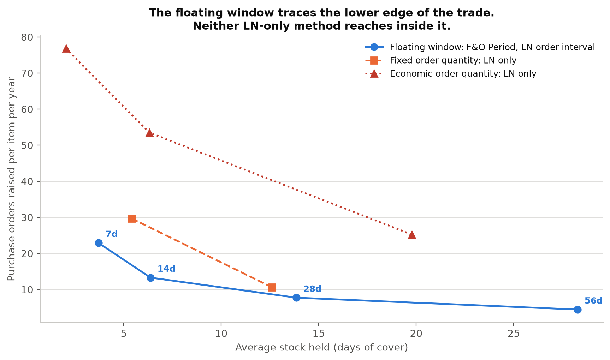

# Master planning in Dynamics 365 F&O and Infor LN

Which lot-sizing rules the two products actually share, and whether the two that F&O does not have are worth asking for.

Supporting code for *Master planning (MRP) module in Dynamics 365 F&O and Infor LN*, published by CodeCore Dynamics.

---

## What this does

Both products size replenishment orders with a small set of documented rules. This repository reimplements those rules from Microsoft's and Infor's own documentation, replays two years of a real order book through all of them under rolling regeneration, and scores the outcome per business case.

The headline is a negative result. On lot sizing the two products agree almost entirely, and the two methods only Infor LN documents did not improve on the coverage code F&O already ships.

| Business case | Best rule on the balanced score | Available in | Margin over second |
|---|---|---|---|
| Fast-moving distributor | 7 day floating window | Both | 0.50, a tie |
| Long-lead importer | 56 day floating window | Both | 2.81, a tie |
| Spare parts operation | 56 day floating window | Both | 9.93, decided |
| Seasonal wholesaler | 7 day floating window | Both | 0.13, a tie |
| Volatile demand | 14 day floating window | Both | 1.02, a tie |

Fixed Order Quantity and Economic Order Quantity, which LN documents and F&O has no coverage code for, never placed better than third of eleven.



The setting that does decide service is not a lot-sizing rule at all. It is the coverage time fence, and each day it falls short of the lead time costs 0.451 percentage points of fill, at a robust t of -34.7 over 5,880 item-scenarios.

## The rules, and which product documents them

| Mechanism | Dynamics 365 F&O | Infor LN |
|---|---|---|
| One order per requirement | `Requirement` coverage code | `Lot-for-Lot` order method |
| Group demand in a floating window | `Period` coverage code | `Order interval` |
| Replenish to a maximum | `Min./Max.` | `Replenish to Maximum Inventory` |
| Fixed order quantity | none | `Fixed Order Quantity` |
| Economic order quantity | none | `Economic Order Quantity` |
| Priority-based replenishment | `Priority` | not established |
| DDMRP decoupling buffer | `Decoupling point` | not established |

F&O's `Period` and LN's `order interval` are the same mechanism. Both open at demand, and neither is anchored to the calendar: Microsoft says "the period starts with the first demand of the item", Infor says the interval is "measured starting at the last generated order". Neither product is a superset of the other.

## Data

Two public files.

**Online Retail II**, the transaction file of a UK non-store online retailer selling giftware, largely wholesale. 1,067,371 rows, 1 December 2009 to 9 December 2011, across 5,305 stock codes. Published through the [UCI Machine Learning Repository](https://archive.ics.uci.edu/dataset/502/online+retail+ii) under CC BY 4.0, which permits redistribution with attribution. It is 44MB and is committed through Git LFS, so the repository runs as cloned. If it is missing for any reason, `run.py` downloads it.

**ONS series J596**, the Retail Sales Index for non-store retailing, value not seasonally adjusted. Committed under `Dataset/ONS/` as plain CSV, and used once as an external check. The seasonally adjusted twin of the same series was deliberately not used, because the check turns on whether the seasonal pattern matches.

## Running it

```bash
pip install -r requirements.txt
```

```bash
python run.py
```

Cloning needs Git LFS installed, or the workbook arrives as a pointer file. The first run derives and caches a daily demand matrix, so it takes appreciably longer than later ones. It writes `outputs.txt`, six PNGs and the results CSVs into the working directory.

### Confirming it worked

Four structural checks run before anything else and abort the run on failure. They are identities, not plausibility tests, so a defect cannot pass them by luck.

| Check | What it asserts |
|---|---|
| Wagner and Whitin bound | No lot-sizing rule may cost less than the exact optimum |
| Unit bucket identity | A one day window must equal one order per requirement |
| Zero-noise identity | With a perfect forecast, a plan whose boundaries do not depend on demand must not move |
| Reproducibility | A rerun in a fresh process must reproduce stored results exactly |

Three of the four failed when first written, and each failure was a real defect: the dynamic programme tiled calendar periods rather than demand occurrences, the replay committed orders on their receipt date rather than their release date, and runs were seeded from Python's `hash`, which is salted per process.

Section 3 of `outputs.txt` should also report a correlation of **0.858** between this firm's monthly revenue and the ONS non-store retailing index, with both series peaking in November. If that is off, the date handling has shifted and nothing downstream is reliable.

## Files

| File | Does |
|---|---|
| `config.py` | Every tunable value. No logic |
| `data.py` | Fetch, filter, classify |
| `engine.py` | The lot-sizing rules, and Wagner and Whitin as a bound |
| `rolling.py` | Rolling regeneration: replan on a moving demand signal |
| `scenarios.py` | Five business cases, scored by category |
| `fence.py` | What a coverage time fence shorter than the lead time costs |
| `sensitivity.py` | Which results depend on the forecast-error assumption |
| `selftest.py` | The four structural checks |
| `external.py` | The ONS check |
| `report.py` | Builds `outputs.txt`, one function per section |
| `figures/` | One module per figure, each exposing `render()` |

## Parameters that are judgement, not derivation

Each of these is a choice. Moving any of them moves some conclusion.

| Parameter | Value | Where |
|---|---|---|
| Demand classification cutoffs | ADI 1.32, CV² 0.49 | `config.ADI_CUT`, `config.CV2_CUT` |
| Review period behind the headline classification | weekly | `config.HEADLINE_PERIOD` |
| Activity filter | 12 demand days, 180 day window | `config.MIN_DEMAND_DAYS`, `config.MIN_ACTIVE_DAYS` |
| Firm demand visibility | 28 days | `config.VISIBILITY_DAYS` |
| Replan cadence | 7 days | `config.REPLAN_EVERY` |
| Opening stock | 14 days of mean demand | `config.OPENING_STOCK_DAYS` |
| Margin below which a case is a tie | 3.0 points | `config.TIE_MARGIN` |
| Spread below which a category is unranked | see table | `config.MIN_SPREAD` |
| Business case lead times and forecast errors | see table | `config.CASES` |
| EOQ setup-to-holding ratios | 10, 100, 1000 | `config.EOQ_RATIOS` |

The cutoffs come from Syntetos, Boylan and Croston, who derived them for selecting a forecasting method rather than a lot-sizing rule. Using them to segment coverage codes is this analysis extending their work, not a claim they make.

## Code that is present but unused in the article

`engine.period_anchored` and `engine.period_anchored_at_need` implement a calendar-anchored time window. An earlier version of this analysis presented that as an Infor LN capability F&O lacks. It is not one. LN's time-based grouping is the order interval, which floats with demand exactly as F&O's `Period` does, and LN's plan periods are the buckets an item master plan is recorded in rather than a lot-sizing rule.

Both functions are retained because the comparison between them is instructive: placing a receipt on the period boundary rather than at the first demand inside it held up to 27 per cent more stock and raised up to 75 per cent more orders. Where a receipt sits inside a window matters more than whether the window is anchored. Neither is called by `run.py`.

`engine.period_varying` implements plan periods of varying length. It is unused for the same reason.

## Known limits

This is a wholesaler's order book. It carries no bills of material, no routings and no capacity, so nothing here tests dependent demand, multi-level netting or capacity scheduling. That bounds the findings to purchasing and distribution, which is where the lot-sizing literature places uncapacitated results.

No safety stock is modelled, and F&O's minimum coverage is a standard setting any implementation with a long lead time would use. The fence magnitudes are therefore an upper bound. Wemmerlöv (1989) reports that introducing safety stocks "generates even larger inventories and also more orders", so both figures here would rise.

No Dynamics 365 F&O system and no Infor LN system was run. Both sets of rules are reimplementations of documented behaviour, and a behaviour differing from the documentation is invisible to this method. Where Infor's manuals are silent, the assumption made is recorded in the module that makes it.

Plan stability is computed throughout and no claim rests on it. Counting a planned order as changed by a fixed number of units and by a fixed percentage produce conclusions pointing in opposite directions, which is a property of the measure rather than of the products.

## On method

The analysis code and the initial draft were produced with Claude Code. The dataset and the configuration claims were verified against the vendors' published documentation before publication. The code is public, so the analysis can be checked.

## Licence

MIT. See `LICENSE`.
